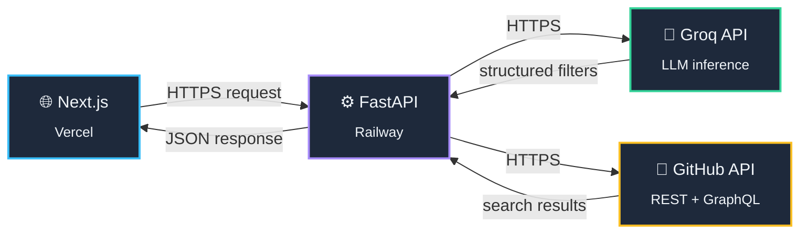

# GitHub Explorer

## 🔭 What It Does

Ever tried to find a project on GitHub and gotten lost in `is:public stars:>1000 language:python pushed:>2023-01-01` syntax soup? **GitHub Explorer** kills the cheat sheet. Just type what you're actually thinking — *"popular python ML libraries updated this year"* — and it finds it.

Under the hood, it reads your sentence like a person would, figures out what you *actually* mean, and turns it into a precise GitHub search — stars, language, license, topic, activity, all of it — without you ever touching a search qualifier. If your query is vague, it doesn't guess wildly; it asks a quick follow-up question, the way a good search assistant should.

**Try things like:**
- *"trending rust CLI tools with good first issues"*
- *"archived repos older than 5 years with no license"*
- *"JavaScript UI libraries with over 10k stars, excluding forks"*

No syntax. No filters to memorize. Just describe it.

---

## ⚙️ The Pipeline (Technical Deep Dive)

### Architecture at a glance

The frontend never talks to Groq or GitHub directly, and never holds a credential of any kind. Every search request goes through the FastAPI backend, which is the only thing that owns the Groq and GitHub API keys.

### The 5-step search pipeline

Each `POST /api/search` request runs through a strict, single-direction pipeline (`search_service.orchestrate`):

**1. Interpret** — The raw query, plus the system prompt (`config/prompts.py`), goes to Groq's chat-completions endpoint with `temperature=0` and forced JSON output. Groq's job is purely translation: turn free text into a structured `Filters` object — no query building, no GitHub knowledge required of it.

**2. Validate** — The JSON Groq returns is parsed into a strict Pydantic model (`SearchInterpretation` / `Filters`), with `extra="forbid"` on every model. If Groq hallucinates a field that isn't in the schema, or returns malformed structure, this fails closed with a `groq_invalid_output` error rather than silently passing garbage downstream. If Groq itself flags the query as ambiguous, the pipeline short-circuits and returns a clarification question immediately — before touching GitHub at all.

**3. Resolve topic** — If the interpreted query includes a `topic` filter (e.g. "python" → should map to GitHub's actual `python` topic slug), a dedicated resolver runs an 8-step algorithm:
   - Query GitHub's `/search/topics` for an exact case-insensitive match → auto-accept
   - No exact match → retry with loosened variants (strip hyphens/underscores, try singular/plural)
   - Score all candidates against the original input using fuzzy string matching (`rapidfuzz`)
   - Top score ≥ confidence threshold (default `0.80`) → auto-accept
   - Top score below threshold → return a clarification with the best guess
   - Zero candidates found at all → `topic_not_found`, no clarification (nothing to suggest)

   Topic resolutions are cached (5-minute TTL) since the same topic gets asked about repeatedly across users.

**4. Build the query** — A pure, zero-I/O function (`query_builder.build`) deterministically converts the validated `Filters` + resolved topic slug into GitHub's actual search-query string (`stars:>1000 language:python topic:machine-learning ...`). This function is intentionally side-effect-free: same input always produces the same output, which is what makes Groq's LLM output safe — it can never smuggle arbitrary GitHub search syntax through, since only the explicitly-mapped fragments are ever emitted, in a fixed order.

**5. Search GitHub** — The final query string is sent to GitHub's GraphQL API (not REST) for repository search, with the requested page size clamped server-side to `MAX_RESULTS`, and cursor-based pagination (`after` cursor) for subsequent pages.

### Backend stack
- **FastAPI** — async Python web framework, single shared `httpx.AsyncClient` for connection pooling across the app's lifetime
- **Groq** — LLM inference for natural-language → structured filter interpretation (model configurable via `GROQ_MODEL`, currently `openai/gpt-oss-120b`)
- **GitHub REST + GraphQL APIs** — topic search (REST) and repository search (GraphQL)
- **rapidfuzz** — fuzzy string matching for topic resolution
- **slowapi** — per-client rate limiting (default 30 req/min), with a distinct `rate_limited` error shape separate from GitHub's own error format
- **Redis (optional) / in-memory TTL cache** — falls back automatically to in-process caching if `REDIS_URL` isn't set, so it works fine on a single instance without extra infrastructure
- **pydantic-settings** — every environment variable the service depends on is declared once in `config/settings.py`; nothing else in the codebase touches `os.environ` directly, keeping configuration fully auditable from one file
- **pytest / pytest-asyncio** — unit tests cover the query builder, topic resolver, pagination, and input validation independently

### Frontend stack
- **Next.js 16** (App Router) + **React 19**
- **Tailwind CSS 4** for styling, with a light/dark theme provider
- **Motion** (Framer Motion successor) for UI animations
- A single typed API client (`lib/api-client.ts`) is the *only* place in the frontend that knows the backend's URL or wire format — every component only ever sees clean, camelCase TypeScript types, converted from the backend's snake_case JSON at that one boundary

### Deployment
- **Backend** → Railway, auto-detected as a Python service via `requirements.txt`, served with `uvicorn app.main:app --host 0.0.0.0 --port $PORT`
- **Frontend** → Vercel, standard Next.js build, `NEXT_PUBLIC_API_URL` env var points it at the Railway backend's public URL
- **CORS** is locked down to an explicit allow-list (`ALLOWED_ORIGIN`, comma-separated for multiple origins) rather than a wildcard, since the backend is the sole holder of both the Groq and GitHub credentials

### Design principles worth calling out
- **Fail closed, not silently** — a bad LLM output, an unresolvable topic, or a malformed filter never gets guessed past; it surfaces as a typed error or a clarification question.
- **One direction of dependency** — route handlers call `search_service.orchestrate`, which calls the specialist services (`groq_service`, `topic_resolver`, `query_builder`, `github_service`) in sequence. No other module is allowed to call more than one of those directly, keeping the call graph shallow and easy to reason about.
- **Pure functions where it matters** — `query_builder.build` has zero I/O by design, making it trivially unit-testable and guaranteeing deterministic, injection-safe GitHub query strings regardless of what the LLM returns.